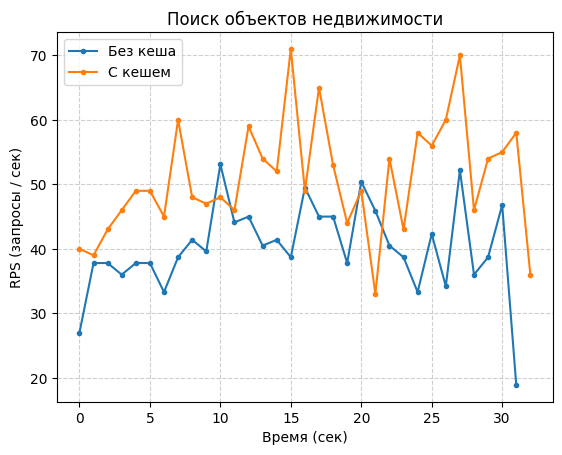
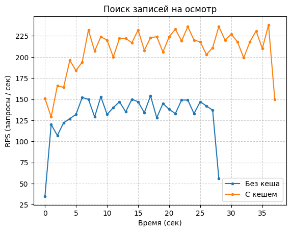
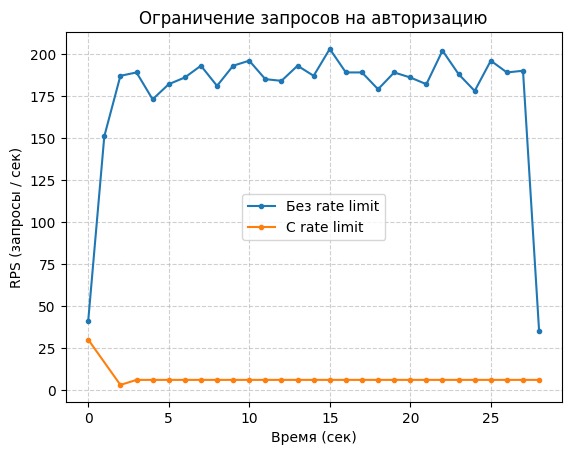

# Оптимизация обработки запросов

## Кеширование результатов

### Определение нагруженных операций

Стратегия кеширования результатов решают проблему эффективности обработки запросов за счет того,
что сервис не обращается теперь к хранилищу данных напрямую, что считается за дорогую операцию из-за
общения по сети, выполнения дорогих операций поиска, а "запоминает" результат прошлой операции и возвращает
его вместо этого.

Обычно кеширование применяют к операциям, которые при использовании сервиса используются наиболее часто.
В текущем проекте из таких операций можно выделить следующие:

- Поиск объектов недвижимости, так как это является основным юзкейсом для клиентов,
  которые хотят купить объект недвижимости. И выполняться она будет очень часто, так как
  у клиентов возникает необходимость в периодическом обновлении объектов недвижимости, которые
  их интересуют.

- Поиск записей на осмотр пользователя, так как у клиентов часто может возникать необходимость
  вспомнить, для каких объектов недвижимости они записаны на осмотр.

- Поиск записей на осмотр объекта недвижимости, так как эта операция используются в юзкейсе, идущем
  после поиска объектов недвижимости. Когда после поиска объектов пользователь обнаружит интересующий
  его объект, то с большой долей вероятности он решит просмотреть, на какую дату можно запланировать его
  осмотр.

### Определение стратегий кеширования

Обычно, базовой стратегией кегирования при взаимодействии с хранилищем является Cache-Aside, так как
она наиболее предсказуемая, проста в отладке и стандартна для web API. По этой причине я решил использовать
эту стратегию для перечисленных выше операций.

#### Cache size

Однако, стоит учитывать, что ключей может быть достаточно много, так как множество возможных
ID пользователей / объектов недвижимости и возможных параметров для поиска может иметь огромные размеры.
По этой причине я решил ограничить размер кеша. При ограничении размера кеша возникает необходимость
в определении метода вытенения закешированных значений. Здесь я выбрал метод LRU, чтобы наиболее
частые запросы оставались в кеше как можно дольше.

#### TTL

Также, стоит учитывать, что для нас неэффективно хранить долго закешированные значения. По этой причине
я добавил механизм TTL для закешированных значений. Если закешированное значение хранится слишком долго в кеше,
то с большой долей вероятности оно вряд ли будет использоваться, и необходимость в нем исчезает.

Для перечисленных выше операций параметр TTL имеет следующие значения:

- Поиск объектов недвижимости: 5 - 15 минут, так как информация об объекте недвижимости меняются не каждую секунду.
  К тому же, пользователь, подбирающий объект недвижимости, вряд ли ожидает, что цена изменится прямо во время ввода
  фильтров. Если же мы будем использовать высокое значение TTL для таких запросов, то кеш быстро забьется "мусорными"
  ключами от уникальных комбинаций фильтров, которые больше не повторятся.

- Поиск записей на осмотр: 1 - 5 минут, так как записи на осмотр являются самыми динамичными данными в проекте.
  Пользователь может записаться на осмотр, и другой пользователь должен увидеть, что слот занят, почти сразу.

### Анализ эффективности кеширования

Проведем анализ эффективности использования кеша для перечисленных выше сценариев. Начнем со сценария
поиска объектов недвижимости. Для реализации нагрузочного тестирования на целевой сервис была написана
утилита `test_properties.py`. Нагрузочное тестирование производилось через следующую команду:

```shell
uv run --project utils/ utils/test_properties.py stats.json --properties=1000 --workers=20
```

Ниже на графике приведены результаты нагрузочного тестирования для поиска объектов недвижимости. Как видим,
использование кеша действительно дало положительный результат, в чем можно убедиться по более высоким значениям
RPS. То есть сервис стал способен обрабатывать больше запросов на поиск объектов.



Далее проведем анализ эффективности использования кеша для поиска записей на осмотре. Для проведения
нагрузочного тестирования была написана утилита `test_viewings.py`. Нагрузочное тестрование производилось
через следующую команду:

```shell
uv run --project utils/ utils/test_viewings.py stats.json --viewings=2000 --workers=4
```

Ниже на графике приведены результаты нагрузочного тестирования для поиска записей на осмотр объектов недвижимости.
Как видим, использование кеширования значительно помогло в эффективности обработки запросов. Количество RPS
ощутимо увеличилось в сравнении с отсутствие кеша.



## Ограничение RPS для запросов

В целях безопасности и контроля нагрузки на конкретные операции обычно применяют стратегию Rate Limit.
Rate Limit позволяет ограничить RPS для конкретного endpoint-а. Если запросов становится слишком много,
то запросы, выходящие за ограничение, отклоняются со стороны сервиса с статус кодом `429`.

### Определение операций

Для применения Rate Limit был выбран endpoint для авторизации пользователя, так как этот сценарий
может быть подвержен такому риску, как брутфорс паролей или credential stuffing. Поэтому
целесообразно ограничить нагрузку на эту операцию.

### Выбор стратегии

Для сценариев, которые учитывают требования к безопасности, лучшим выбором является Sliding Window Counter
или Sliding Window Log. Второй алгоритм предлагает более высокую точность, однако он потребляет значительно
больше ресурсов в сравнении со Sliding Window Counter. Также, есть стратегия Fixed Window, но эта стратегия
уязвима к атаке, когда злоумышленник может отправить огромное количество в последнюю секунду окна, а потом
такое же количество запросов в начале следующего окна, из-за чего может превышаться ограничение по RPS.

### Анализ эффективности Rate Limit

Теперь проанализируем, на сколько выбранная стратегия ограничения обработки запросов помогает в решении
поставленной проблемы. Для проведения нагрузочного тестирования была написана утилита `test_login_limit.py`.
Само нагрузочное тестирование производилось через следующую команду:

```shell
uv run --project utils/ utils/test_login_limit.py stats.json --workers 30
```

Как видим на графике ниже, использование Sliding Window Counter действительно помогло в задаче
контроля нагрузки на операцию авторизации пользователей. Единственное только, что в начале виден скачок
в значении RPS и идущий далее резкий спад, что связано с тем, что в начале окно не было заполнено, как и прошлое,
из-за чего в первую секунду лимит был сразу исчерпан, после чего сервис в последующую секунду начал откидывать все
запросы.


