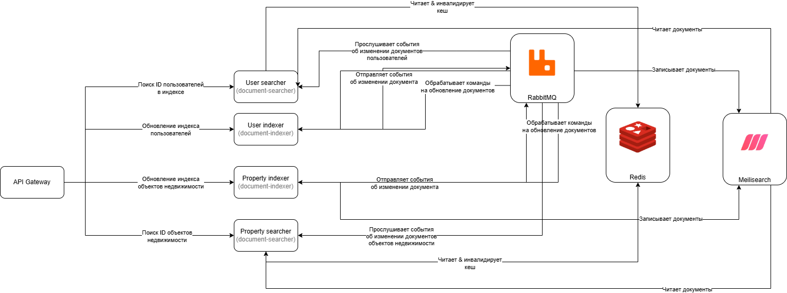

# Описание Event-Driven архитектуры

## Описание кейса

Представим, что пользователи начали жаловаться на слишком строгие фильтры для
поиска объектов недвижимости и пользователей. Они часто совершают небольшие ошибки
при вводе города или имени пользователя, и в результате получают пустой список.

Также, из-за того, что для эффективности поиска объектов недвижимости мы используем
индекс в Mongo, операция обновления и создания объектов недвижимости начинают оказывать
слишком большую нагрузку на хранилище из-за необходимости перестраивать каждый раз индекс.

## Решение

Для решения перечисленных выше проблем предлагается вынести индексацию объектов недвижимости
и пользователей в отдельные сервисы. Для решения проблемы с ошибками, которые пользователи
допускают при вводе фильтров, больше всего подходят такие решения, как `ElasticSearch` / `OpenSearch`,
так как они позволяют осуществлять поиск по документам даже с учетом ошибок в фильтрах.
К тому же такие системы работают гораздо эффективнее при текстовом поиске, чем Mongo.
В рамках лабораторной работы мы будем использовать `MeiliSearch`, как более легковестную альтернативу.

### Использование паттерна CQRS

Чтобы решить проблемы с долгим обновлением индекса, которое проводится при обработке запроса
на обновление / создание объекта недвижимости, попробуем сделать эту операцию асинхронной.

Однако, заметим, что процесс получения результатов поиска значительно отличается от процесса обновления
документов. Здесь нам необходимо осуществлять операцию **синхронно**, дождавшись результатов поиска
и вернув их пользователю.

В итоге видим расхождение между процессами обновления данных и их чтением. Для решения этой
проблемы можно воспользоваться архитектурным паттерном CQRS.

Так как обновление документов у нас происходит асинхронно, то мы можем воспользоваться
очередями сообщений. В частности, RabbitMQ. Выделим логику по обновлению документов в отдельный сервис.
Так как процесс обновления индекса для объектов недвижимости и пользователей идентичен (в общем случае
есть некоторый индекс документов, у документов есть поля и `id`), то выделим эту логику в общий
сервис [`document-indexer`](./document-indexer/), а детали сервиса (такие как поля документа, индекс в котором
будем проводить обновление документов) выделим в конфигурационные поля.

Так как получение документов у нас происходит синхронно, то мы можем воспользоваться
стандартными протоколами, такими как HTTP. Выделим логику по поиску документов по указанным фильтрам
в отдельный сервис [`document-searcher`](./document-searcher/), и выделим детали сервиса (такие как индекс,
в котором необходимо производить поиск) в конфигурационные поля.

### Масштабирование сервис

Отмечу, что предлагаемое решение также способно к горизонтальному масштабированию. Если мы заметим,
что сервис по индексации документов не справляются или операции по поиску документов выполняются
слишком долго, мы спокойно можем добавить инстансы сервиса для увеличения производительности системы целиком.

В `document-indexer` это предоставляется "из коробки", так как мы используем очереди сообщений, которые
уже предоставляют возможность для горизонтального масштабирования. В `document-searcher` мы можем добиться
распределения нагрузки через промежуточный узел в виде balancer.

### События

После перемещения логики по индексации и поиску документов в отдельные сервисы заметим, что кеш
для поиска объектов недвижимости и пользователей в API Gateway уже не нужен. Мы можем перенести кеширование
в `document-searcher`. Но тогда возникает проблема - как нам очищать кеш, когда документы обновяться?

В этом случае нам подойдет Event-Driven подход. При обновлении документов `document-indexer` будет
отправлять события, говорящие о том, что документ с определенным `id` был изменен. `document-searcher`
же будет обрабатывать такие события, проводя инвалидацию кеша.

Также, для разграничения событий, чтобы, к примеру, `document-searcher` для поиска пользователей понимал,
что обновился документов именно в его индексе, добавим `routing_key`.

### Итоговая архитектура решения

